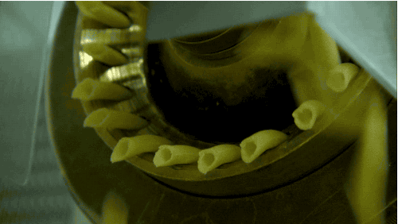

footer: @DEGoodmanWilson
autoscale: true
build-lists: true
theme: GitHub

<!--

  This presentation was given by D.E. Goodman-Wilson at Amsterdam.rb on 18 Sept 2018
  Copyright (C) 2018 D.E. Goodman-Wilson.

  This presentation is designed for Deckset. https://www.deckset.com/

-->


# [fit] Let’s Build a
# [fit] GitHub App!

D.E. Goodman-Wilson
Developer Advocate
GitHub

---

[.build-lists: false]


# Who?

* Developer Advocate @ **GitHub**
* Amateur Rubyist
* Professional C++ist
* Likes to combine APIs and IoTs
* Sailor of boats
* Player of Magic

---



# [fit] Automate
# [fit] all the
# [fit] things

---


# Yeah but…
# [fit] What even is a GitHub App?

---


---

| | **OAuth App** | **GitHub App**|
|---|:---|:---|
| _Who?_ | Impersonates a user | Is its own thing |
| _Access_ | Same as
 the user | Limited to installations |
| _Scope_ | Coarse-grained | Fine-grained |
| _Auth_ | OAuth | JWT |

---

# What can you build?

- Custom Workflows
  - Bespoke
  - Open Source
- Third-Party Integrations
- Native Apps

---


---


---


---

[.background-color: #FFFFFF]
[.header: #303030, alignment(left), line-height(0.8), text-scale(0.8), Apex New Medium]

# Let’s automate issue triage

---

[.build-lists: false]

# Automatically add labels

- bug
- enhancement
- question

automatically on issue creation,
using NLP to analyze the issue title

---

# What do we need to build?

- One-shot to train an NLP model
- App to label new issues on creation

---

[.autoscale: false]

# What do we need to build?

- GitHub account
- Recast.ai account
- Octokit.rb

---

[.autoscale: false]
[.build-lists: false]

# What do we need to build?

- GitHub account
- Recast.ai account
- Octokit.rb


---

# Train an NLP model

[.text: #FFFFFF, alignment(left), line-height(1.0), text-scale(1.0), Apex New Book]
[.text-emphasis: #9AC6FF, alignment(left), line-height(1.0), text-scale(0.9), Hack Regular]

- Grab issues labeled _bug_ with Search API
- Quit when we hit the max (currently 1,000) results
- Take a break when we hit the rate limiter
- Send tagged issue titles to RecastAI for model building
- Repeat for _enhancement_ and _question_

---

[.text: #FFFFFF, alignment(left), line-height(1.0), text-scale(1.0), Apex New Book]
[.text-emphasis: #9AC6FF, alignment(left), line-height(1.0), text-scale(0.9), Hack Regular]

# Label new issues

- Receive _issues_ event
- Check whether _action_ is _opened_
- Analyze issue title
- Assign a label using Issues API

---

[.background-color: #FFFFFF]
[.header: #303030, alignment(left), line-height(0.8), text-scale(0.8), Apex New Medium]

# Enough talk. Let's code.

---

# Follow along

-  [DEGoodmanWilson/triagebot](https://github.com/DEGoodmanWilson/triagebot)
- one-shot: **train.rb**
- app: **server.rb**

---

# (Or just try it out)

- [https://github.com/apps/don-s-triage-bot](https://github.com/apps/don-s-triage-bot)
- Install on a repo
- Create a new issue
- Or just create an issue on
 [DEGoodmanWilson/sandbox](https://github.com/DEGoodmanWilson/sandbox)

---

^ Authenticating an App

[.code-highlight: all]
[.code-highlight: 1-5]
[.code-highlight: 7]
[.code-highlight: 9]
[.code-highlight: 11-14]
[.code-highlight: all]

```ruby
payload = {
    iat: Time.now.to_i,
    exp: Time.now.to_i + (10 * 60),
    iss: APP_IDENTIFIER
}

jwt = JWT.encode(payload, PRIVATE_KEY, 'RS256')

app_client ||= Octokit::Client.new(bearer_token: jwt)

installations = app_client.find_app_installations()
installation_id = installations[0]['id']
installation_token = app_client.create_app_installation_access_token(installation_id)[:token]
client = Octokit::Client.new(bearer_token: installation_token)
```

---

^ Training the model

[.code-highlight: all]
[.code-highlight: 4-11]
[.code-highlight: 5]
[.code-highlight: 6-7]
[.code-highlight: 8-10]
[.code-highlight: 2, 25-27]
[.code-highlight: 13-17]
[.code-highlight: 18-23]
[.code-highlight: all]

```ruby
loop do
  before = Time.now

  begin
    issues = client.search_issues("label:#{label}", page: page)
  rescue Octokit::UnprocessableEntity => ex
    break
  rescue Octokit::TooManyRequests => ex
    sleep(2)
    next
  end

  expressions = []
  for expression in issues['items'] do
    expressions.push({source: expression['title'], language: {isocode: 'en'}})
    puts expression['title']
  end

  result = HTTParty.post(
    "https://api.recast.ai/v2/users/degoodmanwilson/bots/triagebot/intents/#{label}/expressions/bulk_create",
    body: {expressions: expressions},
    headers: {'Authorization' => "Token #{RECASTAI_DEV_TOKEN}"}
  )

  after = Time.now
  sleepy_time = 2 - (after - before)
  slept = sleep(sleepy_time) unless sleepy_time <= 0
end
```

---

^ Webhook signature checking
^ This is an extra step that apps must take to verify it is github sending the event

[.code-highlight: all]
[.code-highlight: 7-12]
[.code-highlight: 14-16]
[.code-highlight: 17]
[.code-highlight: 18]
[.code-highlight: 19]
[.code-highlight: 20]
[.code-highlight: all]

```ruby
class GHAapp < Sinatra::Application

# ...

  before do
    request.body.rewind
    payload_raw = request.body.read 
    begin
      @payload = JSON.parse payload_raw
    rescue
      halt 401
    end

    # The signature comes in with header x-hub-signature, and looks
    # like "sha1=123456" We should take the left hand side as the signature
    # method, and the right hand side as the HMAC digest (the signature) itself.
    their_signature_header = request.env['HTTP_X_HUB_SIGNATURE'] || 'sha1='
    method, their_digest = their_signature_header.split('=')
    our_digest = OpenSSL::HMAC.hexdigest(method, WEBHOOK_SECRET, payload_raw)
    halt 401 unless their_digest == our_digest

    # create and authenticate client here ...
  end
```

---

^ Webhook for receiving events

[.code-highlight: all]
[.code-highlight: 1]
[.code-highlight: 2]
[.code-highlight: 3]
[.code-highlight: 5]
[.code-highlight: all]

```ruby
  post '/' do
    case request.env['HTTP_X_GITHUB_EVENT']
    when 'issues'
      # Add code here to handle the event that you care about!
      handle_issue_opened_event(@payload) if @payload['action'] == 'opened'
    end

    'ok' # we have to return _something_ ;)
  end
```

---

^ Event handler

[.code-highlight: all]
[.code-highlight: 3-7]
[.code-highlight: 8-17]
[.code-highlight: 19]
[.code-highlight: 21]
[.code-highlight: all]

```ruby
  helpers do
    def handle_issue_opened_event(payload)
      repo = payload['repository']['full_name']
      issue_number = payload['issue']['number']
      title = payload['issue']['title']
      recast_request = RecastAI::Request.new(RECASTAI_TOKEN)
      recast_result = recast_request.analyse_text(title)

      # take the highest probability intent
      best_intent = nil
      best_intent_score = 0
      for intent in recast_result.intents
        if intent.confidence > best_intent_score
          best_intent_score = intent.confidence
          best_intent = intent.slug
        end
      end

      return true if best_intent.nil?

      @client.add_labels_to_an_issue(repo, issue_number, [best_intent])

      true
    end

  end
end # class GHAapp
```

---


---

# Putting it all together

- Working code:
  -  [DEGoodmanWilson/triagebot](https://github.com/DEGoodmanWilson/triagebot)
- RecastAI:
  - [https://recast.ai/degoodmanwilson/triagebot/train](https://recast.ai/degoodmanwilson/triagebot/train)
- Try it yourself!
  - [https://github.com/apps/don-s-triage-bot](https://github.com/apps/don-s-triage-bot)

## Thank you!
